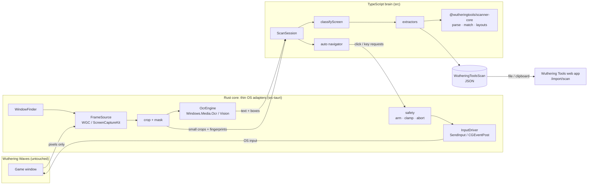
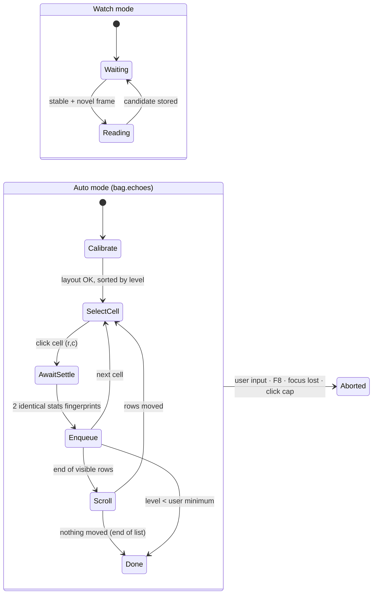

# Architecture

How the scanner is put together and why. For the reasoning behind each choice, follow the ADR links. For rules, see [CLAUDE.md](../CLAUDE.md). For a guided tour of the Rust code, see [rust-primer.md](rust-primer.md).

> Status: design of record for v0.1 (echoes). Sections marked *(planned)* describe code that doesn't exist yet. Update this file in the same change that makes it true.
>
> Implemented so far: capture/OCR/input adapters (Windows, macOS), safety, Diagnostics, bundled game data, batched region reads, and the **watch-mode echo session** (`src/session/`: `echoSession.ts` → `echoExtract.ts` → `exportScan.ts`, UI in `ScanView.vue`).

## 1. The big picture

**Rule of thumb:** Rust knows *how to talk to the OS*. TypeScript knows *what the game screen means*. ([ADR 0003](adr/0003-rust-adapters-ts-brain-split.md))

| Layer | Owns | Doesn't own |
|---|---|---|
| Rust `platform/` | Finding the window, grabbing frames, cropping, native OCR, sending input | Any knowledge of echoes, stats, screens |
| Rust `safety` | Whether input is allowed right now, clamping, abort, User ID masking | Deciding *what* to click |
| TS `session/` | Screen classification, extraction, confidence, dedupe, output | OS calls |
| TS `auto/` | What to click next and when the screen has settled | How a click is delivered |
| `scanner-core` (npm, shared with the web app) | Parsing, fuzzy matching, ROI fractions. Game data is supplied by Wavescan ([ADR 0019](adr/0019-consume-scanner-core-with-injected-data.md)) | Anything desktop-specific |

## 2. One frame, end to end (watch mode)

1. **`FrameSource`** delivers the game window's client area as BGRA (about 8–60 fps, depending on mode). The cursor isn't captured.
2. **Fingerprint** (Rust): tiny luma grids of the panel and stats regions, which are cheap to compare. They're sent to TS with each frame tick.
3. **`ScanSession`** (TS) runs the existing `stability.ts` gate. It acts only on a *stable and novel* frame: the panel stopped changing and differs from the last one read.
4. **`classifyScreen`** finds which screen this is (v0.1: `bag.echoes`, or `unknown`) from anchor text/regions.
5. The **extractor** for that screen asks Rust for the crops it needs (`crop_regions` with ROI fractions from `scanner-core` `layout.ts`). Rust crops, upscales, and OCRs each one natively, then returns text + line boxes. Set icons come back as small bitmaps for template matching.
6. The extractor feeds that into `scanner-core` (`parseEchoCandidate`, `matchSetFirst`, `resolveEchoByNameAndCost`, substat snapping) → a `ScanCandidate` with per-field `high|low` confidence.
7. **Dedupe** by signature (`dedupe.ts`) → candidate store → the live UI list.
8. On export: candidates → `WutheringToolsScan` JSON (validated against `schema/scan.v1.json`).

The full frame never crosses IPC. Only fingerprints, small crops and text do ([ADR 0003](adr/0003-rust-adapters-ts-brain-split.md)).

## 3. Watch vs auto: same pipeline, different driver

- **Watch mode** sends no input at all. It needs no admin rights (Windows) and only Screen Recording permission (macOS).
- **Auto mode** is opt-in and armed per session. Its OCR runs asynchronously through a queue (`queue.ts`), so clicking never waits on reading. The target is ≤150 ms per echo; measurements are in [screens/echoes.md](screens/echoes.md). ([ADR 0006](adr/0006-watch-and-auto-modes-and-fair-play-risk.md))

## 4. Rust trait seams

Everything OS-specific sits behind four traits in `src-tauri/src/traits.rs`. Tests use the fakes in `src-tauri/src/testing.rs`, which simulate the window (focus, minimise, close), the cursor and user mouse movement, OS input rejection, and replayed frames. Platform implementations live in `platform/` (`platform::create()` picks one per OS). **Windows** is implemented: Win32 window enumeration, `windows-capture` (WGC, cursor off, border off on Windows 11, title bar cropped; each optional setting is requested only when the Windows build supports it, otherwise the system default is kept), and `Windows.Media.Ocr` (en-US). **macOS** is implemented: `objc2-screen-capture-kit` (window list + single-window capture), Vision OCR, Core Graphics events, and Accessibility/Screen Recording checks with instructions ([ADR 0018](adr/0018-macos-adapters.md)). `platform/unsupported.rs` covers only Linux (the Docker check container).

Key types:

- `GameWindow { id, client_rect, scale_factor, focused, minimized }`, always re-queried before an action.
- `Frame`: BGRA pixels with no row padding, plus a sequence number.
- `Key`: a **closed list** (`Escape`, `B`, `C`), so auto mode can never type anything else.
- Layout coordinates are fractions (`FracPoint`, `FracRect`) of the client area, converted to pixels only at the last moment (`geometry.rs`). Out-of-range fractions are **refused, never clamped**.

| Trait | Windows impl | macOS impl | Fake (tests) |
|---|---|---|---|
| `WindowFinder` | Win32 `EnumWindows`, window class `UnrealWindow` + title | SCK shareable-content snapshot, app name / title | Fixed rect |
| `FrameSource` | `windows-capture` (Windows.Graphics.Capture) | `objc2-screen-capture-kit` (SCStream, single-window filter) | PNGs/video frames from `fixtures/` |
| `OcrEngine` | `Windows.Media.Ocr` via `windows` crate | Vision `VNRecognizeTextRequest` via `objc2-vision` | Canned text per crop |
| `InputDriver` | `SetCursorPos` + `SendInput` (scancodes) | `CGEvent` posts + Accessibility check | Records calls for assertions |

([ADR 0004](adr/0004-native-os-ocr-with-tesseract-fallback.md), [ADR 0005](adr/0005-window-capture-wgc-and-screencapturekit.md))

## 5. IPC commands

Implemented (milestone 3). Each one is listed in `build.rs` and granted in `capabilities/default.json` ([ADR 0016](adr/0016-diagnostics-screen-and-capture-commands.md)):

| Command | Args → Result | Notes |
|---|---|---|
| `app_info` | `()` → `AppInfo { name, version, platform }` | |
| `find_game_window` | `()` → `GameWindow` | Matches window class `UnrealWindow` + title; never opens the game process |
| `window_candidates` | `()` → `WindowCandidate[]` | Only titles containing "Wuthering" |
| `start_capture` / `stop_capture` | `{ maxFps }` → `GameWindow` / `()` | fps clamped 1–60 |
| `capture_status` | `()` → `CaptureStatus { running, fps, frame }` | |
| `capture_preview` | `{ maxWidth }` → raw bytes `[w u32][h u32][RGBA]` | Downscaled, **User ID masked in Rust** |
| `ocr_region` | `{ region: FracRect }` → `OcrResult { lines, elapsed_ms, width, height }` | Crops via `crop_outside_user_id`; runs on a blocking worker thread |
| `auto_mode_status` | `()` → `AutoModeStatus { state, actions_used }` | `state`: `"Disarmed"` · `"Armed"` · `{ "Aborted": reason }` |
| `arm_auto_mode` / `disarm_auto_mode` | `{ confirmation }` / `()` → `AutoModeStatus` | Arming needs the exact phrase; never persisted |
| `auto_focus_game` | `()` → `AutoModeStatus` | Guarded; needs arming, not focus ([ADR 0017](adr/0017-input-spike-and-auto-mode-commands.md)) |
| `auto_click` | `{ target: FracPoint }` → `AutoModeStatus` | Every `AutoMode` check; Windows: `SetCursorPos` + `SendInput` |

| `sample_regions` | `{ regions: FracRect[], maxWidth }` → raw bytes `[seq u64][count u32]` + per region `[w u32][h u32][RGBA]` | Small images for change detection (fingerprints computed in TS by scanner-core). **Pins** the sampled frame |
| `read_regions` | `{ seq, regions: RegionRead[] }` → `RegionText[]` | OCRs the **pinned** frame `seq` (so text matches the frame judged stable), one thread per region; `FrameExpired` if `seq` isn't pinned |

*(Planned)*: `layout_check`, scroll/key commands (driver already supports them), F8 stop hotkey, `save_debug_frame` (setting-gated, masked).

Errors cross IPC as `{ kind, message }` (`error.rs` → `src/ipc/types.ts`). `src/ipc/commands.ts` has one typed wrapper per command, plus `errorMessage` / `errorKind`.

## 6. Threads

- **Capture thread** (owned by the capture crate) → latest frame kept in a single-slot buffer. Old frames are dropped, never queued.
- **OCR worker pool** (Rust, 2–4 threads) runs the native OCR calls in parallel.
- **Tauri main thread** handles IPC only and never blocks on capture or OCR.
- **Webview (TS)**: session logic. The TS queue keeps clicking (auto) separate from reading.

## 7. Security model {#security}

| Control | Where |
|---|---|
| Window-only capture | `FrameSource` takes a window id. There's no desktop-capture code path |
| No memory/file access to the game | Nothing in the codebase opens the game process or install dir. Reviewed in PRs per CLAUDE.md |
| Input gating | `safety::AutoMode`: armed (typed phrase) → window exists, focused, not minimised → cursor where we left it (else the user took over) → target inside the client rect → under the action cap. **Any failure aborts** until the user re-arms |
| Abort | Cursor-drift check between our clicks, F8 global hotkey, focus-loss event |
| User ID never read | `crop_outside_user_id` refuses OCR crops that overlap it. `mask_user_id` blacks it out before anything is written to disk ([ADR 0013](adr/0013-user-id-masking.md)) |
| Tauri capabilities | `src-tauri/capabilities/default.json`: only our commands + updater + dialog save + clipboard write |
| CSP | `default-src 'self'`. No remote scripts or styles |
| Least privilege | Admin (Windows) / Accessibility (macOS) requested only when arming auto mode |
| Supply chain | `cargo deny`, `npm audit`, lockfiles committed, signed + attested release builds ([ADR 0011](adr/0011-signing-provenance-and-updater.md)) |

### Network {#network}

Only these outbound connections exist. Each can be turned off in Settings ([ADR 0010](adr/0010-no-telemetry-network-allowlist.md)):

| Host | Purpose | Verified how |
|---|---|---|
| `github.com` / `objects.githubusercontent.com` | Updater manifest + signed update bundles | Tauri updater signature (minisign public key compiled in) |
| `www.wutheringtools.com` | `scanner-data.json` (game data refresh, *planned*) | Detached signature checked against a compiled-in public key. Falls back to the bundled snapshot ([ADR 0020](adr/0020-game-data-snapshot-and-source.md)) |

Adding a host means: ADR → this table → the README table → CSP `connect-src`.

## 8. Game data freshness

Game data (echo names, sets, costs, stat tables, characters, weapons) comes from Wuthering Tools, which publishes it as `https://www.wutheringtools.com/scanner-data.json` on every deploy ([ADR 0020](adr/0020-game-data-snapshot-and-source.md)).

- **Bundled snapshot:** `src/data/scanner-data.json` (committed; refresh with `npm run data:update`, which checks the format, version and hash). `src/data/scannerData.ts` validates it and calls scanner-core's `setScannerGameData` in `main.ts`, before anything else runs. The hash is shown on the home screen and in Diagnostics reports.
- **Runtime refresh** *(planned)*: opt-in, signed, and fails safe to the bundled snapshot, so new echoes are recognised without an app update.

## 9. Output & handoff

- Contract: [`schema/scan.v1.json`](../schema/scan.v1.json) ([ADR 0008](adr/0008-scan-json-schema-v1.md)). It uses the web app's PascalCase keys, so the web app does no fuzzy matching.
- Handoff: **Save file** or **Open in Wuthering Tools** (JSON → clipboard, then the OS opens `/import/scan`, where the user clicks Paste). No URL payload, no localhost server, no upload ([ADR 0009](adr/0009-handoff-via-file-and-clipboard-no-server.md)).

## 10. Build & release

- CI (`.github/workflows/ci.yml`): fmt, clippy, nextest, deny, vitest, vue-tsc on `windows-latest` + `macos-14`.
- Tester builds (`tester-build.yml`, on merge to `main`): unsigned (macOS ad-hoc signed) `.dmg` + NSIS `.exe` → rolling `tester-build` pre-release with SHA-256 sums. The commit id is compiled in as `WAVESCAN_BUILD`.
- Release (`release.yml`, on tag): `tauri build` → sign (Azure Trusted Signing for Windows / Developer ID + notarization for macOS) → SHA-256 checksums + `actions/attest-build-provenance` → GitHub Release + updater manifest ([ADR 0011](adr/0011-signing-provenance-and-updater.md)).
